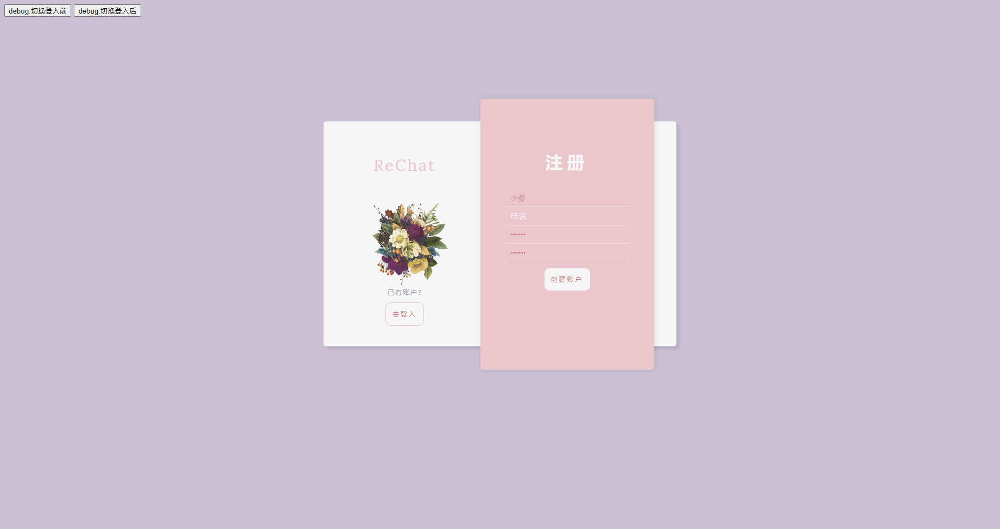
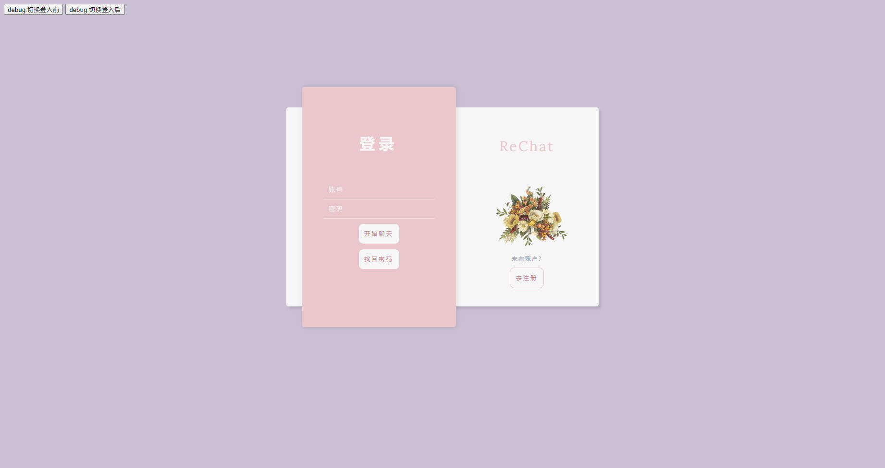
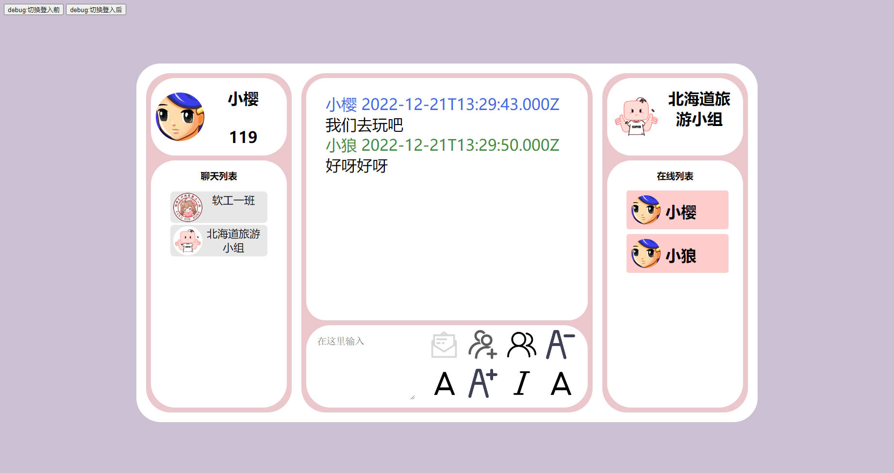
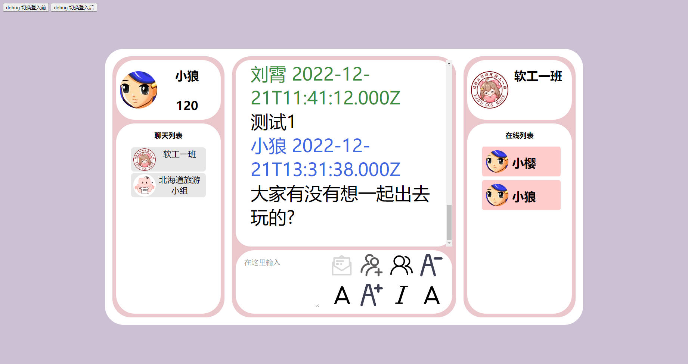

# ReChat
 B/S 即时通讯

 前端使用原生HTML,CSS,JS
 后端使用Node.js
 通过Socket.io通信

# 前置
Git
Node
Mysql

# 下载
```
git clone https://github.com/Shelter-Xingwei/ReChat.git
```

# 运行
## 建表
运行./db/my.sql
## 安装依赖
```
npm i
```
## 启动服务器
```
node index.js
```

# 演示





